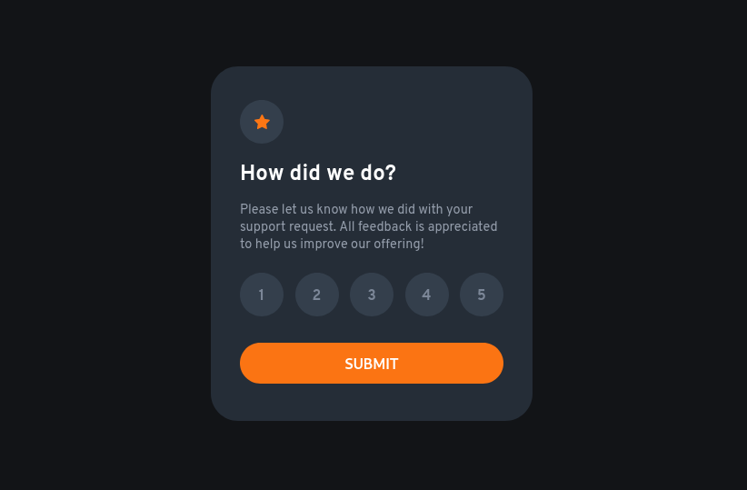

# Frontend Mentor - Interactive rating component solution

This is a solution to the [Interactive rating component challenge on Frontend Mentor](https://www.frontendmentor.io/challenges/interactive-rating-component-koxpeBUmI). Frontend Mentor challenges help you improve your coding skills by building realistic projects. 

## Table of contents

- [Overview](#overview)
  - [The challenge](#the-challenge)
  - [Screenshots](#screenshot)
  - [Links](#links)
- [My process](#my-process)
  - [Built with](#built-with)
  - [What I learned](#what-i-learned)
  - [Continued development](#continued-development)

## Overview

### The challenge

Users should be able to:

- View the optimal layout for the app depending on their device's screen size
- See hover states for all interactive elements on the page
- Select and submit a number rating
- See the "Thank you" card state after submitting a rating

### Screenshots

### Links

- Live Site URL: [Interactive Rating Component](https://dyuboki.github.io/frontendMentor_interactiveRatingComponent/)

## My process

### Built with

- Semantic HTML5 markup
- CSS custom properties
- Flexbox

### What I learned

This project sort of acted as a refresher after not studying frontend development for a while.
As such it was a good way of getting back to it!

### Continued development

My dealing with forms feels a bit like I'm going massive detours while I could simplify the process quite a bit. Will look into that.
Also I would love to find a way to add transitions properly, but there are a lot of ways of doing that, should be looking into some of them.

Also gotta better organize CSS files, Good God..

